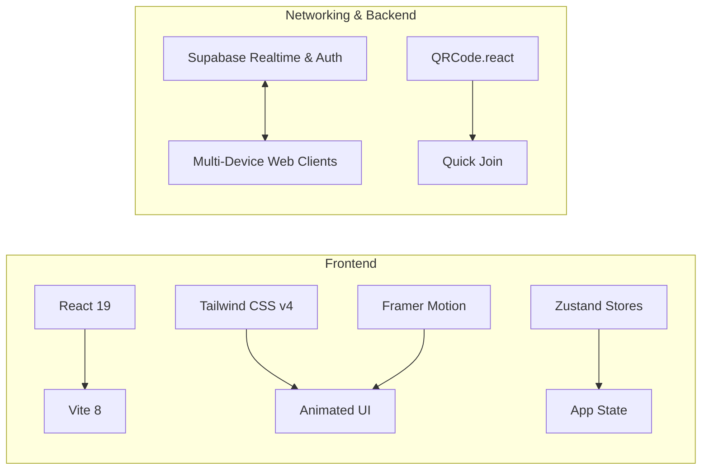

<div align="center">

# 🕵️‍♂️ Undercover / The Imposter
### Modern Social Deduction Party Game Web App

[](https://github.com/SouL-Dev-exe/imposter_project/actions/workflows/deploy.yml)
[](https://SouL-Dev-exe.github.io/imposter_project/)
[](https://react.dev/)
[](https://vite.dev/)
[](https://tailwindcss.com/)
[](https://supabase.com/)
[](LICENSE)

<p align="center">
  A sleek, mobile-first web app for the popular social deduction party game. Play together on a single phone with <b>Pass & Play</b> mode, or host an <b>Online Multiplayer</b> room where everyone joins on their own device via QR Code or room code.
</p>

[🕹️ **Play Live Demo**](https://SouL-Dev-exe.github.io/imposter_project/) • [📖 **How to Play**](#-how-to-play) • [✨ **Features**](#-features) • [🛠️ **Tech Stack**](#%EF%B8%8F-tech-stack) • [🚀 **Local Setup**](#-quick-start)

</div>

---

## 🎮 How to Play

The game pits a group of **Civilians** against secretly infiltrated **Impostors** and a wildcard **Mr. White**.

| Role | Knowledge | Mission |
| :--- | :--- | :--- |
| 👥 **Civilian** | Receives the real secret word | Give subtle clues, identify contradictions, and vote out all impostors. |
| 🎭 **Impostor** | Receives a closely related word | Blend in without realizing you have a different word, then figure out the civilian word. |
| 👤 **Mr. White** | Receives **no word at all** | Bluff through the clue rounds, avoid detection, and steal the win by guessing the word. |

### 🔄 Game Flow
1. **Lobby & Setup:** Pick player names, adjust role distribution, and choose categories.
2. **Secret Reveal:** Each player privately checks their role and word.
3. **Clue Round:** Players take turns giving a single-word or short clue related to their word.
4. **Discussion & Vote:** Debate who sounded suspicious and eliminate a suspect.
5. **Endgame & Revenge Guess:** If an Impostor or Mr. White is caught, they get one final multiple-choice guess to snatch victory!

---

## ✨ Features

- 📱 **Pass & Play (Single Device):** Flip-to-reveal role cards with privacy screens so you can play anywhere using just one phone.
- 🌐 **Real-Time Multi-Device Sync:**
  - Create online rooms and invite friends instantly via **Room Code** or **QR Code**.
  - Powered by **Supabase Realtime Broadcast & Presence channels**.
- 📦 **Dynamic Word Pools & Zero Memorization:**
  - Pre-packaged themed pools (Foods, Tech & Gadgets, Drinks & Desserts, Fruits & Veggies, Places, etc.).
  - Words are randomized dynamically from categories so players cannot memorize fixed word pairs.
- 🛠️ **In-App Custom Pack Editor:**
  - Build custom categories and word lists right in the browser.
  - Export and import packs as `.json` files.
  - Cloud pack sync and community pack sharing.
- 🗳️ **Smart Voting & Sudden Death:**
  - Anonymous balloting system.
  - Automated tie-breaker and sudden-death runoff rounds when votes are split.
- 🔊 **Zero-Dependency Web Audio:**
  - Built-in sound effects synthesizer (beeps, reveals, voting countdowns, buzzer) via the native Web Audio API.
- 🎉 **Visual Flair & Celebration:**
  - Responsive dark-mode UI with fluid Framer Motion transitions and canvas confetti celebrations.

---

## 🛠️ Tech Stack



- **Core:** [React 19](https://react.dev/), [Vite](https://vite.dev/)
- **Styling:** [Tailwind CSS v4](https://tailwindcss.com/)
- **Animations:** [Framer Motion](https://www.framer.com/motion/)
- **State Management:** [Zustand](https://github.com/pmndrs/zustand) with persistent local storage
- **Routing:** [React Router](https://reactrouter.com/) (configured with `HashRouter` for GitHub Pages support)
- **Realtime & Cloud:** [Supabase](https://supabase.com/) (Realtime Broadcast, Presence, Database, and Auth)
- **Audio:** Web Audio API (Native browser synthesizer)
- **CI/CD:** GitHub Actions (`deploy.yml`) & `gh-pages`

---

## 🚀 Quick Start

### Prerequisites
Make sure you have [Node.js](https://nodejs.org/) installed (v18.0.0 or higher).

### 1. Clone & Install
```bash
git clone https://github.com/SouL-Dev-exe/imposter_project.git
cd imposter_project
npm install
```

### 2. Run Locally
```bash
npm run dev
```
Open **[http://localhost:5173](http://localhost:5173)** in your browser.

### 3. Production Build & Linting
```bash
# Type check and lint
npm run lint

# Compile production bundle to /dist
npm run build

# Preview production build locally
npm run preview
```

---

## 🚀 Deployment

### GitHub Pages (Automated CI/CD)
This repository includes an automated GitHub Actions workflow (`.github/workflows/deploy.yml`). Any push to the `main` branch automatically builds and deploys the latest version to GitHub Pages.

### Manual Deploy
You can also deploy manually at any time via:
```bash
npm run deploy
```

Windows users can simply double-click:
```cmd
deploy_now.bat
```

---

## 📂 Project Structure

```text
imposter_project/
├── .github/workflows/       # Automated GitHub Actions deployment pipeline
├── public/                  # Favicon, icons, and static assets
├── src/
│   ├── assets/              # SVGs and branding media
│   ├── components/          # Modular UI components (buttons, badges, modal dialogs)
│   ├── data/
│   │   ├── categoryPools.js # Word categories & dynamic pool generators
│   │   └── defaultPacks.js  # Built-in pack configurations
│   ├── hooks/
│   │   ├── useAudio.js      # Web Audio API sound generator
│   │   └── useTimer.js      # Round and countdown timer hook
│   ├── pages/
│   │   ├── Home.jsx         # Landing page and mode picker
│   │   ├── Lobby.jsx        # Pass & Play game setup & player management
│   │   ├── OnlineLobby.jsx  # Supabase realtime multi-device room lobby
│   │   ├── Reveal.jsx       # Card-flip role & word assignment
│   │   ├── Clues.jsx        # Turn-based clue sequence and timer
│   │   ├── Vote.jsx         # Interactive voting & suspect unmasking
│   │   ├── Result.jsx       # Winner declaration & impostor counter-guess
│   │   └── PackEditor.jsx   # Custom word pack creator & JSON exporter
│   ├── store/
│   │   ├── gameStore.js        # Core game loop & turn state
│   │   ├── multiplayerStore.js # Supabase realtime rooms & sync
│   │   ├── packStore.js        # Word packs & local storage
│   │   └── authStore.js        # Optional player profile & session auth
│   ├── utils/
│   │   ├── gameLogic.js     # Role assignment & winner resolution algorithms
│   │   ├── supabase.js      # Supabase client configuration
│   │   └── translations.js  # Localization & display strings
│   ├── App.jsx              # Main router & theme wrapper
│   ├── index.css            # Tailwind CSS imports & theme tokens
│   └── main.jsx             # React entry point
├── package.json
└── vite.config.js
```

---

## 🤝 Contributing

Contributions are what make the open-source community an amazing place to learn, inspire, and create. Any contributions you make are **greatly appreciated**.

1. Fork the Project
2. Create your Feature Branch (`git checkout -b feature/AmazingFeature`)
3. Commit your Changes (`git commit -m 'feat: add some amazing feature'`)
4. Push to the Branch (`git push origin feature/AmazingFeature`)
5. Open a Pull Request

---

## 📝 License

Distributed under the MIT License. See `LICENSE` for more information.

<div align="center">
  Made with ❤️ for game nights and fun gatherings.
</div>
